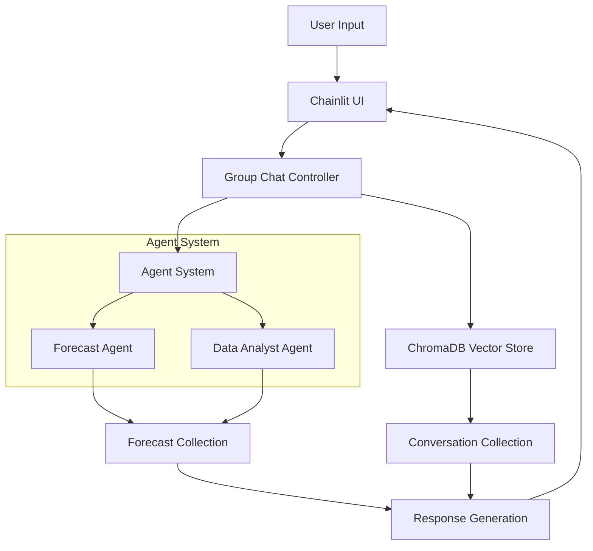

# Workforce Management Agent System

## Overview
An intelligent workforce management system powered by AI agents that provides forecasting insights and analytics for workforce planning. The system uses ChromaDB for vector storage and retrieval, enabling context-aware conversations and data analysis.

## Features
- 🤖 Multi-agent conversation system
- 📊 Workforce volume forecasting
- 📈 Business impact analysis
- 💾 Persistent conversation history
- 🔄 Context-aware responses
- 📋 Team comparison capabilities

## Architecture



## Technical Stack
- **Frontend**: Chainlit UI
- **Backend**: Python with async support
- **Vector Database**: ChromaDB
- **LLM**: Google's Gemini 2.5 Flash
- **Dependencies**: See requirements.txt

## Setup Instructions

1. Clone the repository:
```bash
git clone <repository-url>
cd workforce-management-agent
```

2. Install dependencies:
```bash
pip install -r requirements.txt
```

3. Configure ChromaDB:
```bash
# Default path: ~/notebooks/workforce_management/chromadb_vector
# Can be modified in config.py
```

4. Run the application:
```bash
chainlit run app.py --port 8002 -w
```

## System Flow

1. **User Input Processing**
   - User sends message through Chainlit UI
   - Message is processed by Group Chat controller
   - Context is retrieved from ChromaDB

2. **Agent Interaction**
   - Forecast Agent processes workforce data
   - Data Analyst Agent provides insights
   - Agents collaborate through function calls

3. **Data Storage**
   - Conversations stored in dedicated collection
   - Forecast data maintained separately
   - Vector similarity search for context retrieval

4. **Response Generation**
   - Context-aware responses generated
   - Business metrics and forecasts included
   - Formatted for clear presentation

## Collections Structure

### Forecast Collection
- Stores workforce forecast data
- Includes business areas, substreams, teams
- Maintains historical and projected volumes

### Conversation Collection
- Stores chat history with metadata
- Enables context retrieval
- Session-based organization

## Usage Examples

1. **Basic Forecast Query**
```plaintext
User: "Show me forecast for logistics support team"
Agent: *Provides forecast data with analysis*
```

2. **Business Impact Analysis**
```plaintext
User: "What's the business impact of October peak?"
Agent: *Analyzes implications and provides recommendations*
```

3. **Team Comparison**
```plaintext
User: "Compare with other teams in same substream"
Agent: *Generates comparative analysis*
```

## Error Handling
- Port conflict resolution
- ChromaDB connection management
- Message deduplication
- Input validation

## Development

### Adding New Features
1. Extend agent capabilities in `/agents`
2. Update ChromaDB collections as needed
3. Modify UI elements in Chainlit

### Testing
```bash
# Run tests
python -m pytest tests/
```

## Troubleshooting

### Common Issues
1. **Port Conflicts**
   - Use different port: `chainlit run app.py --port <port_number>`
   - Check for running instances

2. **ChromaDB Connection**
   - Verify path in config
   - Check permissions
   - Ensure proper initialization

3. **Agent Response Issues**
   - Check LLM configuration
   - Verify function mappings
   - Review conversation context

## Contributing
1. Fork the repository
2. Create feature branch
3. Submit pull request

## License
[Add License Information]

## Contact
[Add Contact Information] 